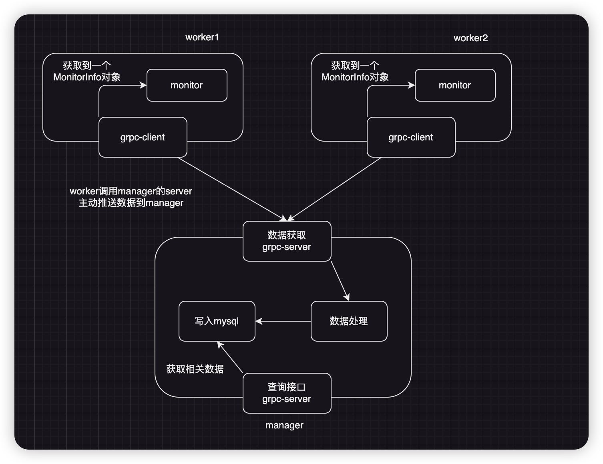

# Linux 监控系统 (linux_monitor_system)

## 1. 项目简介

本系统是一个**分布式 Linux 主机性能监控与查询平台**，采用 **Manager-Worker** 架构：多台机器上的 **Worker** 周期性采集本机 CPU、内存、磁盘、网络、软中断等指标，通过 gRPC 推送到中心 **Manager**；Manager 将数据写入 MySQL，并对外提供统一的 **gRPC 查询服务**，支持按时间范围、服务器、分页等条件查询性能数据、趋势、异常与评分排名。

适用于机房/集群的统一监控、性能回溯与异常分析场景。

---

## 2. 项目特点

- **推送式采集**：Worker 主动向 Manager 推送监控数据，无需 Manager 轮询，便于跨网段、多节点部署。
- **多维度指标**：支持 CPU 负载与状态、内存、磁盘 I/O、网络流量（基于 eBPF）、软中断（SoftIRQ）等；可选内核模块采集更细粒度数据。
- **可扩展查询**：基于 gRPC + Protobuf 的查询 API，支持时间段性能、趋势聚合、异常检测、评分排序及各类详细数据分页查询。
- **文件日志**：Manager/Worker 使用项目内 fastlog 写入文件日志，便于后台运行与问题排查。
- **一键启停**：根目录 `scripts/start.sh`、`scripts/stop.sh` 支持默认启停 Manager+Worker，或通过 `--manager` / `--worker` 只操作其一。

---

## 3. 项目环境

| 类别              | 要求                                                                                                                            |
| ----------------- | ------------------------------------------------------------------------------------------------------------------------------- |
| **构建**    | CMake ≥ 3.20，C++23，gRPC/Protobuf                                                                                             |
| **Manager** | MySQL（或 MariaDB），mysqlclient 库；可选 systemctl/service 用于自动启停 MySQL                                                  |
| **Worker**  | eBPF（libbpf、clang、bpftool）用于网络统计，**必须**；可选内核模块（softirq_collector、cpu_stat_collector）及对应设备节点 |
| **运行**    | Linux；Worker 需 root 或 CAP_BPF/CAP_NET_ADMIN 以加载 eBPF 进行网络监控                                                         |
| **脚本**    | Python 3，Bash；启动/停止脚本依赖项目内 `manager/scripts`、`worker/scripts` 下的 Python 脚本                                |

**环境依赖安装（推荐）：**

首次使用或新机器上可执行项目提供的 **`scripts/env.sh`** 自动安装上述依赖（需 root 或 sudo）。脚本会根据系统类型选择包管理器并安装 gcc/g++、cmake、clang、Python3、gRPC/Protobuf、bpftool/libbpf、内核头文件、MySQL 等；支持 Debian/Ubuntu 与 RedHat/Fedora/CentOS/Rocky/AlmaLinux。

```bash
./scripts/env.sh
```

**编译示例：**

```bash
mkdir -p build && cd build
cmake ..
make -j4 manager worker
```

---

## 4. 项目使用方法

### 4.1 环境准备（首次或新环境）

在项目根目录执行 **`scripts/env.sh`** 安装构建与运行依赖（编译链、gRPC、eBPF、MySQL 等）；非 root 用户会自动使用 sudo。完成后即可编译与启停服务。

```bash
./scripts/env.sh
```

### 4.2 启动

在**项目根目录**下执行：

```bash
# 同时启动 Manager 和 Worker（默认）
sudo ./scripts/start.sh

# 仅启动 Manager
./scripts/start.sh --manager

# 仅启动 Worker
sudo ./scripts/start.sh --worker
```

- Manager 默认监听 `0.0.0.0:50051`，并会尝试启动/检测 MySQL、初始化数据库与表结构。
- Worker 默认连接 `127.0.0.1:50051`，推送间隔 10 秒；可通过 `worker/scripts/start_worker.py` 的 `--manager`、`--interval` 等参数调整。

### 4.3 停止

```bash
# 同时停止 Manager 和 Worker
./scripts/stop.sh

# 仅停止 Manager
./scripts/stop.sh --manager

# 仅停止 Worker
./scripts/stop.sh --worker

# 停止 Manager+Worker，并停止 MySQL 服务
./scripts/stop.sh --stop-db
```

### 4.4 日志

- Manager 文件日志目录：`manager/logs/`（需以项目根为工作目录启动）。
- Worker 文件日志目录：`worker/logs/`。

### 4.5 监控面板（Web Dashboard）

项目包含可视化监控面板目录：`web_dashboard_example/`。

该面板作为 BFF + 前端 UI，连接 Manager 的 `QueryService`（默认 `127.0.0.1:50051`），提供：

- 实时总览（健康度、节点状态、关键指标）
- 细分监控项（CPU / 内存 / 磁盘 / 网络）
- 完整查询页（评分排行、趋势聚合、异常、网络详情、磁盘详情、内存详情、软中断详情）
- 查询端口清单页（展示 gRPC / HTTP / Socket 暴露入口）

启动方式（在项目根目录）：

```bash
cd web_dashboard_example
npm install
npm start
```

默认访问地址：`http://localhost:3000`。

说明：面板依赖 Manager 查询服务，请先启动 Manager（默认监听 `0.0.0.0:50051`）。

---

## 5. 暴露的查询 API

所有查询均通过 **gRPC 服务 `monitor.proto.QueryService`** 暴露，默认端口与 Manager 监听地址一致（如 `0.0.0.0:50051`）。请求/响应消息定义见 `proto/query_api.proto`。

| API                          | 说明                       | 请求                                                     | 响应                                      |
| ---------------------------- | -------------------------- | -------------------------------------------------------- | ----------------------------------------- |
| **QueryPerformance**   | 时间段内性能数据（分页）   | 服务器名、时间范围、分页                                 | 性能记录列表 + total_count/page/page_size |
| **QueryTrend**         | 变化率趋势（可按间隔聚合） | 服务器名、时间范围、聚合间隔(秒)                         | 趋势记录列表                              |
| **QueryAnomaly**       | 异常数据（超阈值）         | 服务器名(可选)、时间范围、CPU/内存/磁盘/变化率阈值、分页 | 异常记录列表 + 分页信息                   |
| **QueryScoreRank**     | 评分排序（支持升降序）     | 排序方式、分页                                           | 评分记录列表 + 分页信息                   |
| **QueryLatestScore**   | 各服务器最新评分           | 无参                                                     | 最新评分记录列表                          |
| **QueryNetDetail**     | 网络详细数据（分页）       | 服务器名、时间范围、分页                                 | 网络详细记录 + 分页信息                   |
| **QueryDiskDetail**    | 磁盘详细数据（分页）       | 服务器名、时间范围、分页                                 | 磁盘详细记录 + 分页信息                   |
| **QueryMemDetail**     | 内存详细数据（分页）       | 服务器名、时间范围、分页                                 | 内存详细记录 + 分页信息                   |
| **QuerySoftIrqDetail** | 软中断详细数据（分页）     | 服务器名、时间范围、分页                                 | SoftIRQ 详细记录 + 分页信息               |

**公共参数说明：**

- **TimeRange**：`start_time`、`end_time`（google.protobuf.Timestamp）。
- **Pagination**：`page`（从 1 开始）、`page_size`（默认 100）。
- **SortOrder**：`DESC` / `ASC`（用于 QueryScoreRank）。

客户端可通过生成的 gRPC 桩（如 `query_api.grpc.pb.h`）连接 Manager 地址并调用上述 RPC。

---

## 6. 整体架构

### 6.1 架构图



### 6.2 架构设计

本系统采用 **Manager-Worker 中心化架构**，职责清晰、数据单向汇聚，便于扩展多节点与统一查询。

- **角色划分****Worker** 部署在被监控主机上，只负责本机指标采集与主动上报，无状态、可水平扩展。**Manager** 作为中心节点，负责接收所有 Worker 的推送、持久化到 MySQL、计算健康评分，并对外提供唯一的查询入口。前端或其它客户端只连 Manager，不直接访问 Worker，从而避免跨网段、多地址的查询复杂度。
- **通信模式**采用 **推送而非拉取**：Worker 按固定间隔（如 10 秒）调用 Manager 的 gRPC 接口上报一次 `MonitorInfo`。这样 Manager 无需维护 Worker 列表或轮询，Worker 只需配置 Manager 地址即可上线；适合机房内多机部署、且 Manager 与 Worker 可能不在同一网段的场景。
- **数据流**采集 → 推送 → 接收 → 落库 → 查询，形成一条单向链路。Worker 内各监控器（CPU、内存、磁盘、网络、软中断等）将数据汇总到一份 `MonitorInfo` 后，由 MonitorPusher 通过 gRPC 发送；Manager 收到后写入 MySQL 多张表（性能主表、网络/磁盘/内存/软中断详情表），并更新内存中的主机评分供“选优”等逻辑使用；所有历史与实时查询都通过 QueryService 访问 MySQL，保证数据一致性与可回溯。
- **存储与查询分离**
  写入路径（HostManager + MySQL）与查询路径（QueryManager + QueryService）在逻辑上分离：HostManager 只关心“收到推送 → 算分 → 写库”，QueryManager 只关心“按条件查库并返回”。两者共用同一套表结构，便于后续做只读从库、分表等优化而不影响采集链路。

---
